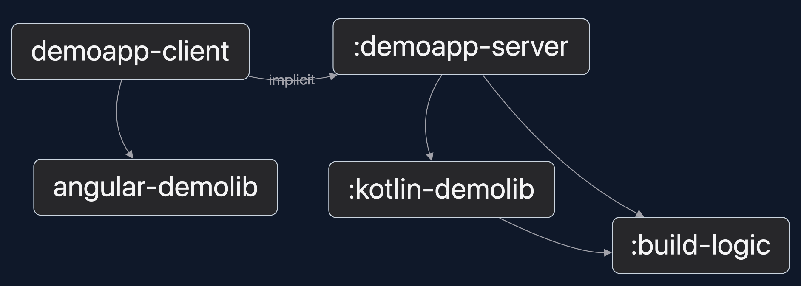

# Minimal Nx Angular Gradle Monorepo

This is an Nx monorepo with both Angular and Gradle projects.

It is based on a [minimal Nx Angular monorepo](https://github.com/pvdhoef/minimal-nx-angular-monorepo)
in which a [minimal Gradle multi-module project](https://github.com/pvdhoef/minimal-gradle-multi-module-project)
has been integrated.

## Gradle support in Nx

Gradle support in Nx can be installed with:
```sh
npm install --save-dev @nx/gradle
```

and refresh `node_modules`
```sh
rm -rf node_modules package-lock.json
npm install
```

Initialize Gradle support in Nx:
```sh
nx generate @nx/gradle:init
```

This will modify `nx.json`. It adds the pattern `"!{projectRoot}/src/test/**/*"` to `namedInputs/production`
and adds the following section to the `plugins` section:
```json
{
    "plugin": "@nx/gradle",
    "options": {
        "testTargetName": "test",
        "classesTargetName": "classes",
        "buildTargetName": "build"
    }
}
```

## The Nx Gradle plugin

The `nx generate @nx/gradle:init` command also adds the plugin `id("dev.nx.gradle.project-graph") version("0.1.4")`
to all Gradle projects but this has to be edited a bit because the inserted code is not completely correct.
It adds this plugin reference via a crude find/replace method and it inserts an outdated `allprojects`
in the main project.

It can be fixed by explicitly adding the Gradle Nx plugin in every `build.gradle.kts`.

Check this by running `gradle tasks` on all Gradle projects and verify that they have the following tasks now:
```
Reporting tasks
---------------
nxProjectGraph - Create Nx project graph for demoapp-server
nxProjectReport - Create Nx project report for demoapp-server
```

After this all Gradle projects will be automatically detected by Nx and all commands can be run via Nx, for example:
```sh
nx tasks demoapp-server
```
Or

```sh
nx build kotlin-demolib
```

The previous command runs in a nice Nx TUI, that can be configured by adding the following section to `ns.json`:
```json
"tui": {
    "enabled": true,
    "autoExit": 5
}
```

## Upgrading to the latest Nx packages

```sh
nx migrate nx@21.4.0
```
and refresh `node_modules`

```sh
rm -rf node_modules package-lock.json
npm install
```

## Dependencies between Angular projects and Gradle projects

When an Angular project depends on a Gradle project, the following can be added to `project.json`:
```json
{
    "name": "demoapp-client",
    "implicitDependencies": ["demoapp-server"],
    "... etc."
```

After this, `nx graph` will show:



## Exclude Gradle 'build-logic' from dependencies graphs

Nx considers Gradle's `build-logic` a project that should be handled as a first class citizen in the monorepo.
While it is actually a centralized Gradle build configuration as code.

To make Nx believe that `build-logic` is not a dependency, add an explicit `project.json` file to each Gradle project
in which this dependency is explicitly disabled:
```json
{
    "name": "kotlin-demolib",
    "implicitDependencies": ["!build-logic"]
}
```

Nx will merge the plugin’s auto-generated metadata with what’s in that file.
